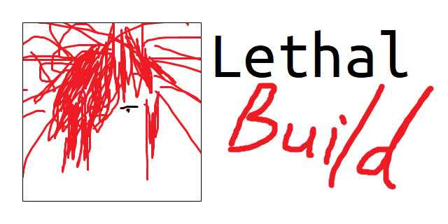

# Lethal Build



> I just want to build, in my way.

This is a library including some tools that can unlock your self, touch your heart, and build your project in a sexy non-mainstream free-spirited hacking way.

## Import

### Common JS

```js
const LB = require('lethal-build')(__dirname);
```

### ES Module

```js
import LBIniter from 'lethal-build';

const LB = LBIniter(import.meta.url);
```

### Typescript

```ts
import LBIniter from 'lethal-build';
// or
import LBIniter = require('lethal-build');

const LB = LBIniter(__dirname);
```

## Demo

```js
const LB = require('lethal-build')(__dirname);
const { snake, exec, outFS, log, dels } = LB;

// Process chain
snake(

  // Compile
  exec('tsc'),

  // Packing
  exec('webpack'),

  // Assemble
  outFS([
    [1, '!function(exp){'],
    [0, 'packed.js'],
    [1, '}(window)'],
  ], 'main.js'),

  // Clear
  dels([
    'lib/index.js',
    'lib/class.js',
    'packed.js',
  ]),

  // Log
  log('finish.'),

);

// Wow, so elegant.
```
